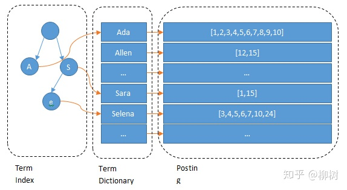

# 倒排索引原理

  倒排索引，也叫反向索引，有反向索引必有正向索引。通俗来讲，正向索引是通过key找value，反向索引是通过value找到key。
假设有个user索引，它有四个字段：分别是name，gender，age，address。画出来的话，大概是下面这个样子，跟关系型数据库一样：

|  id   | name  | gender |
|  ----  | ----  |  ----  |
| 1  | 张三 | 男 |
| 2  | 李四 | 女 |
| 3  | 王五 | 男 |

Elasticsearch建立的索引大致如下：

name 字段：

|  term   | Posting List   
|  ----  | ----  |  
| 张三  | 1 |    
| 李四  | 2 |   
| 王五  | 3 |   

gender 字段：

|  term   | Posting List   
|  ----  | ----  |  
| 男  | [1,3] |    
| 女  | 2 |   

**term（单词）** 段文本经过分析器分析以后就会输出一串单词，这一个一个的就叫做Term

**Posting List（倒排列表）** ：倒排列表记录了出现过某个单词的所有文档的文档列表及单词在该文档中出现的位置信息，每条记录称为一个倒排项(Posting)。根据倒排列表，即可获知哪些文档包含某个单词。（PS：实际的倒排列表中并不只是存了文档ID这么简单，还有一些其它的信息，比如：词频（Term出现的次数）、偏移量（offset）等，可以想象成是Python中的元组，或者Java中的对象）
在搜索引擎中，每个文档都有一个对应的文档 ID，文档内容被表示为一系列关键词的集合。

Elasticsearch分别为每个字段都建立了一个倒排索引，存储了所有符合某个Term的文档ID
只要知道文档ID，就能快速找到文档。可是，要怎样通过我们给定的关键词快速找到这个Term呢？
当然是建索引了，为Terms建立索引，最好的就是B-Tree索引（PS：MySQL就是B树索引最好的例子）。

Lucene 的倒排索，增加了最左边的一层「字典树」term index，它不存储所有的单词，只存储单词前缀，通过字典树找到单词所在的块，
也就是单词的大概位置，再在块里二分查找，找到对应的单词，再找到单词对应的文档列表。

Lucene 为什么不用 b+ 树来搜索数据？
Mysql 为什么不用 倒排索引来检索数据？
Mysql 只有 term dictionary 这一层，是以 b-tree 排序的方式存储在磁盘上的。检索一个 term 需要若干次的 random access 的磁盘操作。而 Lucene 在 term dictionary 的基础上添加了 term index 来加速检索，term index 以树的形式缓存在内存中。从 term index 查到对应的 term dictionary 的 block 位置之后，再去磁盘上找 term，大大减少了磁盘的 random access 次数。
额外值得一提的两点是：term index 在内存中是以 FST（finite state transducers）的形式保存的，其特点是非常节省内存。Term dictionary 在磁盘上是以分 block 的方式保存的，一个 block 内部利用公共前缀压缩，比如都是 Ab 开头的单词就可以把 Ab 省去。这样 term dictionary 可以比 b-tree 更节约磁盘空间。

